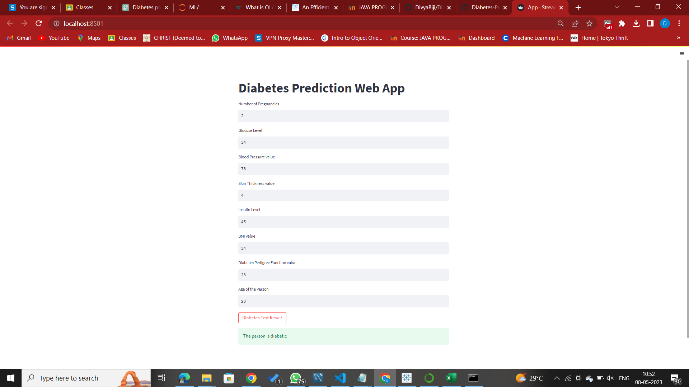

# **Diabetes Prediction Model**
## Overview
In this project, the objective is to predict whether the person has Diabetes or not based on various features such as 

Pregnancies 
Insulin Level 
Age 
BMI.  
The data set that has used in this project has taken from the kaggle . "This dataset is originally from the National Institute of Diabetes and Digestive and Kidney Diseases. The objective of the dataset is to diagnostically predict whether or not a patient has diabetes, based on certain diagnostic measurements included in the dataset. Several constraints were placed on the selection of these instances from a larger database. In particular, all patients here are females at least 21 years old of Pima Indian heritage." and used a simple random forest classifier.

## Techniques Used
Data Cleaning 
Data Visualization 
Machine Learning Modeling 

## Algortihms Used
Logistic Regression 
Support Vector Machine 
KNN 
Random Forest Classifier 
Naivye Bayes 
Gradient Boosting 

## Model Evaluation Methods Used
Accuracy Score 
ROC AUC Curve 
Cross Validation 
Confusion Matrix 

## Motivation
The motivation was to experiment with end to end machine learning project and get some idea about deployment platform like Sreamlit and offcourse this " Diabetes is an increasingly growing health issue due to our inactive lifestyle. If it is detected in time then through proper medical treatment, adverse effects can be prevented. To help in early detection, technology can be used very reliably and efficiently. Using machine learning we have built a predictive model that can predict whether the patient is diabetes positive or not.". This is also sort of fun to work on a project like this which could be beneficial for the society.
## Screenshot

